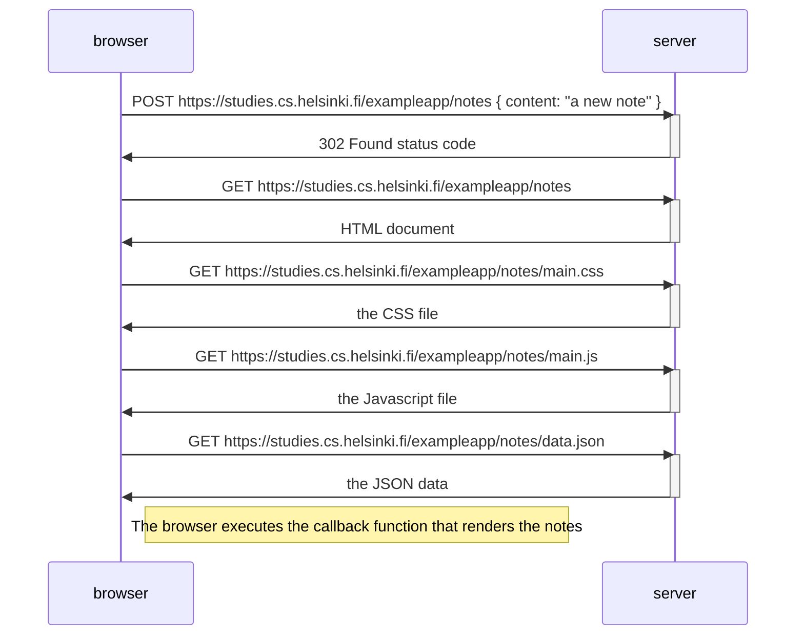

Creating a new note in traditional method

```mermaid
sequenceDiagram;
    participant browser;
    participant server;

    browser->>server: POST https://studies.cs.helsinki.fi/exampleapp/notes { content: "a new note" };
    activate server;
    server->>browser: 302 Found status code;
    deactivate server;

    browser->>server: GET https://studies.cs.helsinki.fi/exampleapp/notes;
    activate server;
    server->>browser: HTML document;
    deactivate server;

    browser->>server: GET https://studies.cs.helsinki.fi/exampleapp/notes/main.css;
    activate server;
    server->>browser: the CSS file;
    deactivate server;

    browser->>server: GET https://studies.cs.helsinki.fi/exampleapp/notes/main.js;
    activate server;
    server->>browser: the Javascript file;
    deactivate server;

    browser->>server: GET https://studies.cs.helsinki.fi/exampleapp/notes/data.json;
    activate server;
    server->>browser: the JSON data;
    deactivate server;

    Note right of browser: The browser executes the callback function that renders the notes;
```